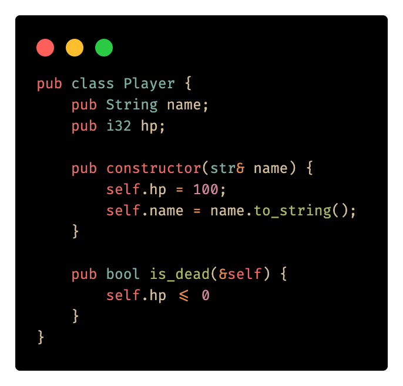

# Mist - A Pragmatic Systems Language built on Rust

<!--
Originally this readme was part of the Carbon Language project, licensed with Apache-2.0
-->

  <a href="https://mist.selimaj.dev">Documentation</a>

<!--
Don't let the text wrap too narrowly to the left of the above image.
The `div` reduces the vertical height. The `picture` prevents autolinking.
-->

<picture></picture>

**Fast and works with Rust**

- All of your favorite Rust libraries work with Mist
- Compiles directly into efficient Rust code
- Zero-cost abstractions, no runtime overhead

**Ergonomic development experience**
- C/C++ style syntax for quick onboarding
- Minimal friction compared to raw Rust
- Designed for fast, readable systems code

**Class and type system**
- class is syntactic sugar for a Rust struct with V Tables
- `class B : A` provides inheritance-style syntax over struct composition
- Classes and structs compile into the same underlying Rust type system model